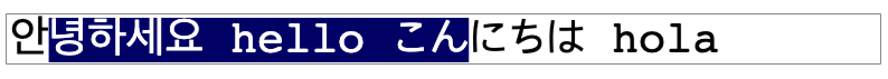

# Text canvas input

 |  |  |  |
--- | --- | --- | --- |
Latest ✔ | Latest ✔ | Latest ✔ | 11 ✔ |

canvas based text input field.

## How to run

just run `npm run dev`

## TODO

- limitRegex
- text clip & viewport
- left/right selection bug fix
- alt + arrow subtle selection bug fix
- placeholder